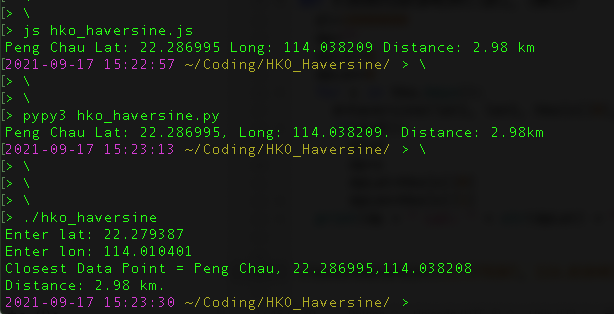
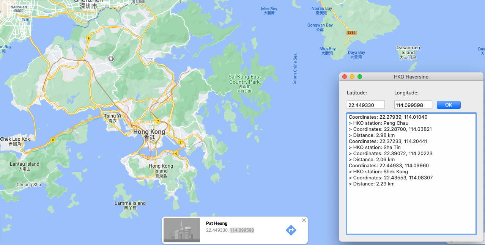

# HKO Haversine

I have had the need, for several projects, to not only implement the haversine function, but also to tie it specifically to Hong Kong Observatory's stations around the city. So I ended up with three versions: C, Javascript, Python. Here they are in all their beauty ;-)



## C version

```bash
gcc hko_haversine.cpp -o hko_haversine
```

## Xojo version

And there's no reason I shouldn't have a [Xojo](https://www.xojo.com/) version!

Here it is in action!

